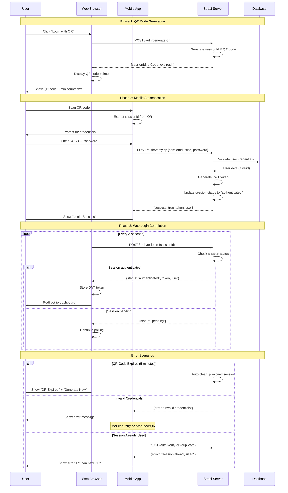

# QR Code Login Sequence Diagram

This document provides a visual sequence diagram for the QR code login flow.

## Sequence Diagram



## Timeline Breakdown

### Immediate Actions (0-5 seconds)
1. User clicks login button
2. QR code generated and displayed
3. User scans QR with mobile app

### Authentication Phase (5-30 seconds)
4. Mobile app prompts for credentials
5. User enters CCCD and password
6. Mobile app sends verification request
7. Server validates and responds

### Completion Phase (30-35 seconds)
8. Web browser receives authentication status
9. User is logged in and redirected

### Total Flow Duration
- **Typical**: 30-60 seconds
- **Maximum**: 5 minutes (QR expiration)

## State Management

### Session States
```
PENDING ──────► AUTHENTICATED ──────► EXPIRED/USED
   │                                      ▲
   └──────────────────────────────────────┘
           (5 minute timeout)
```

### Web Browser States
```
IDLE ──► WAITING_FOR_QR ──► POLLING ──► AUTHENTICATED
  ▲                           │              │
  └───────────────────────────┼──────────────┘
        (Generate New QR)     │
                              ▼
                          QR_EXPIRED
```

### Mobile App States
```
IDLE ──► SCANNING ──► CREDENTIAL_INPUT ──► AUTHENTICATING ──► SUCCESS
                           │                    │              │
                           ▼                    ▼              ▼
                       CANCELLED           ERROR_STATE      COMPLETED
```

## API Call Patterns

### Web Browser API Calls
```
1. POST /auth/generate-qr
   └─► Response: {sessionId, qrCode, expiresIn}

2. POST /auth/qr-login (polling every 3s)
   └─► Response: {status: "pending"} OR {status: "authenticated", token, user}
```

### Mobile App API Calls
```
1. POST /auth/verify-qr
   └─► Request: {sessionId, cccd, password}
   └─► Response: {success: true, token, user} OR {error: "message"}
```

## Security Flow

```
┌─────────────────┐    ┌─────────────────┐    ┌─────────────────┐
│   QR Generation │    │  Authentication │    │   Token Issue   │
│                 │    │                 │    │                 │
│ • Generate UUID │    │ • Validate CCCD │    │ • Generate JWT  │
│ • Set 5min TTL  │    │ • Check password│    │ • 7-day expiry  │
│ • Create QR PNG │    │ • Verify session│    │ • Sign with key │
│ • Store in RAM  │    │ • Single-use    │    │ • Return token  │
└─────────────────┘    └─────────────────┘    └─────────────────┘
```

## Error Handling Matrix

| Scenario | Web Behavior | Mobile Behavior | Server Action |
|----------|--------------|-----------------|---------------|
| QR Expired | Show "Generate New" | N/A | Cleanup session |
| Invalid Credentials | Keep polling | Show error | Keep session pending |
| Network Error | Retry polling | Show retry button | N/A |
| Session Used | Keep polling | Show "Scan new QR" | Return error |
| Server Down | Show connection error | Show connection error | N/A |

## Performance Considerations

### Polling Optimization
- **Interval**: 3 seconds (balance between UX and server load)
- **Timeout**: 5 minutes maximum
- **Exponential Backoff**: On network errors

### Memory Management
- **Session Storage**: In-memory Map (auto-cleanup)
- **QR Code**: Generated on-demand, not stored
- **Cleanup**: Every 60 seconds for expired sessions

### Scalability
- **Concurrent Sessions**: Limited by server memory
- **QR Generation**: CPU-intensive, consider caching
- **Database Queries**: Optimized user lookup by CCCD index

This sequence diagram provides a comprehensive view of the QR code login system's flow, timing, and error handling mechanisms.